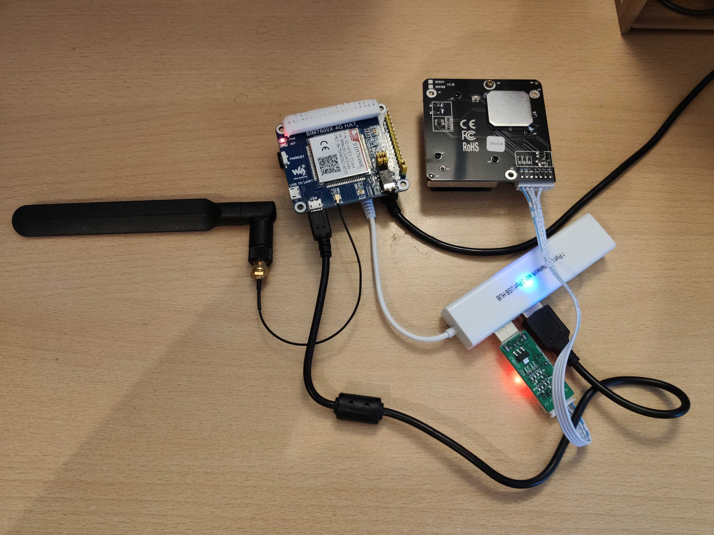
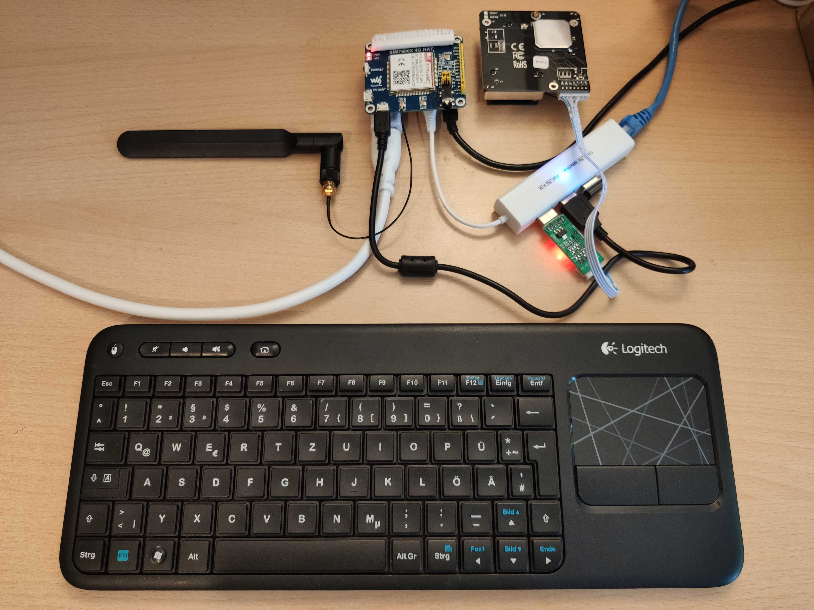

# air-quality-monitor

--------------------------------------------------------------------------------

Activating SSH on Raspberry Pi:

Create an empty file named "ssh" and put in the root folder of "boot" partition in the microSD, and NOT in the "rootfs" partition.

--------------------------------------------------------------------------------

Setting up the Raspberry Pi for running the python code:
```
sudo apt update
sudo apt full-upgrade
sudo shutdown -r now

sudo apt install git
sudo git clone https://github.com/sarkashr/air-quality-monitor.git
```
Note: run `sudo git pull` from inside the `air-quality-monitor` directory to sync with the repository.

```
sudo apt install python3-pip
sudo pip3 install wheel
sudo pip3 install -r /home/pi/air-quality-monitor/code/requirements.txt
```

Setting up the cron table entries:
```
sudo crontab -e
```
then add the following lines to the end of crontab file:
```
@reboot python3 /home/pi/air-quality-monitor/code/aqm.py &
```
Note: Modify the MQTT topic and client_id in aqm.cfg file accordingly.

--------------------------------------------------------------------------------

for setting up a remoteiot.com new device:
```
sudo apt install openjdk-8-jre-headless
```

In the RemoteIoT Dashboard go to Devices and there choose Register New Device.
After filling the fields, copy the command line code and execute it with `sudo` in the RPi.
Most likely there's already an open SSH session to the RPi for pasting and executing the above copied command.

Note: Java 11, 10 & 9 don't work on Pi Zero because of ARMv6 architecture.

--------------------------------------------------------------------------------

For activating SIM7600 module:
```
sudo apt install libqmi-utils udhcpc
```
Then adding the following lines in the crontab just before the main script line:
(Yes, both lines are the same! Seems to connect when run twice)
```
@reboot python3 /home/pi/air-quality-monitor/code/sim7600_connect.py
@reboot python3 /home/pi/air-quality-monitor/code/sim7600_connect.py
```
Note: Modify the APN in the aqm.cfg accordingly.

--------------------------------------------------------------------------------

# Headless Setup


# Setup with Display, Keyboard and Ethernet connected

